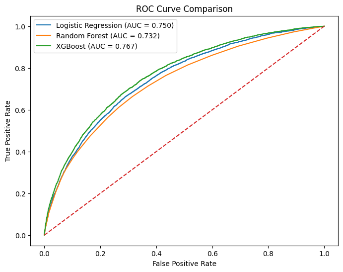
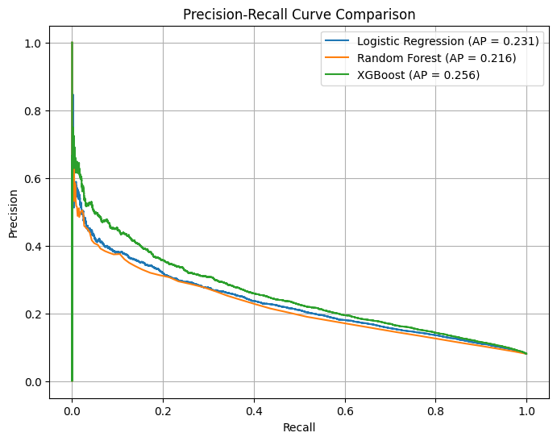
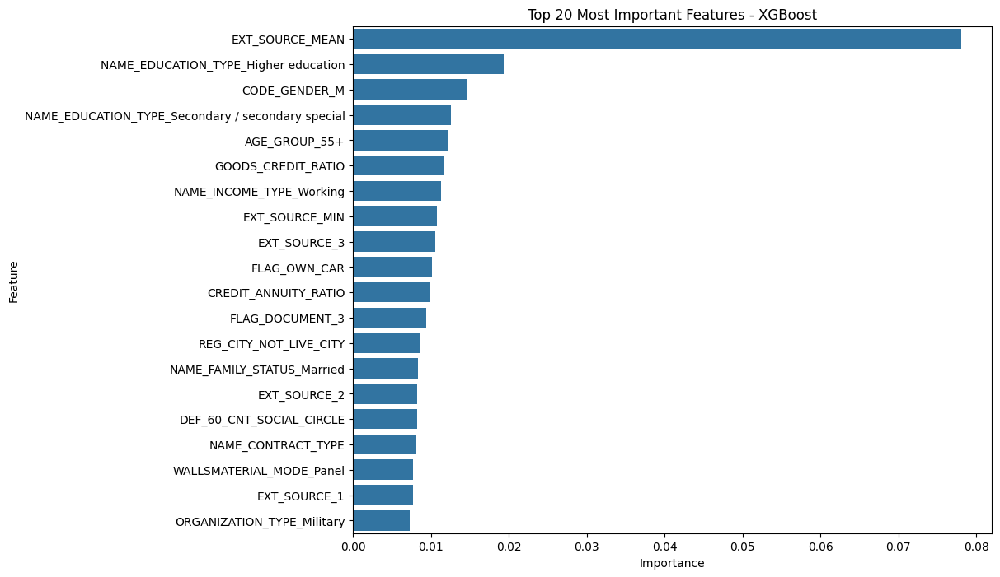

# Home Credit Default Risk Analytics

## Project Overview

This project analyzes customer loan application data from the Home Credit Default Risk dataset to identify borrowers with a high probability of default. The objective is to support data-driven lending decisions through exploratory analysis, feature engineering, predictive modeling, and risk segmentation.

---

## Model Performance

### ROC Curve Comparison

Comparison of classification models using ROC-AUC. XGBoost achieved the highest ROC-AUC score of **0.7667**, indicating better discrimination between default and non-default customers.

### Precision-Recall Curve Comparison

Since the dataset is highly imbalanced, Precision-Recall analysis provides a more meaningful evaluation of model performance. XGBoost achieved the highest Average Precision score (**0.256**) among the evaluated models.

### XGBoost Feature Importance

Feature importance analysis highlights the variables that contributed most to default prediction. External credit score features, income-related variables, and engineered financial ratios emerged as key predictors.

---

## Dataset

* 307,511 customer records
* 210 features after preprocessing
* No missing values
* No duplicate records

---

## Feature Engineering

Created business-focused features such as:

* AGE
* AGE_GROUP
* YEARS_EMPLOYED
* EMPLOYMENT_TO_AGE_RATIO
* CREDIT_INCOME_RATIO
* ANNUITY_INCOME_RATIO
* CREDIT_ANNUITY_RATIO
* INCOME_PER_FAMILY_MEMBER
* INCOME_PER_CHILD
* CHILDREN_RATIO
* EXT_SOURCE_MEAN
* EXT_SOURCE_STD
* EXT_SOURCE_MIN
* YEARS_REGISTRATION
* YEARS_ID_PUBLISH
* GOODS_CREDIT_RATIO
* CONTACT_COUNT
* OWNS_CAR
* OWNS_REALTY

---

## Model Comparison

| Model               | Accuracy | Precision | Recall | F1 Score | ROC-AUC |
| ------------------- | -------- | --------- | ------ | -------- | ------- |
| Dummy Classifier    | 0.9193   | -         | -      | -        | 0.5000  |
| Logistic Regression | 0.6885   | 0.1614    | 0.6814 | 0.2610   | 0.7503  |
| Random Forest       | 0.9194   | 0.5849    | 0.0062 | 0.0124   | 0.7324  |
| XGBoost             | 0.7199   | 0.1765    | 0.6737 | 0.2797   | 0.7667  |

---

## Risk Segmentation

Customers were categorized into:

* Low Risk
* Medium Risk
* High Risk

This segmentation supports more informed lending decisions and prioritization of high-risk applicants.

---

## Technologies Used

* Python
* Pandas
* NumPy
* Matplotlib
* Seaborn
* Scikit-Learn
* XGBoost
* Jupyter Notebook
* Power BI

---

## Repository Structure

home-credit-default-risk-analytics/

├── data/

├── notebooks/

├── images/

├── README.md

├── requirements.txt

└── .gitignore

---

## Key Business Insights

* Customers with high credit-to-income ratios exhibited elevated default risk.
* External credit score features were among the strongest predictors of repayment behavior.
* Feature engineering significantly improved risk characterization.
* XGBoost delivered the strongest overall predictive performance.
* Risk segmentation enables targeted review of potentially risky applicants.

---

## Future Enhancements

* Interactive Power BI Dashboard
* Executive Risk Monitoring Dashboard
* Automated Credit Risk Reporting
* Enhanced Customer Segmentation
